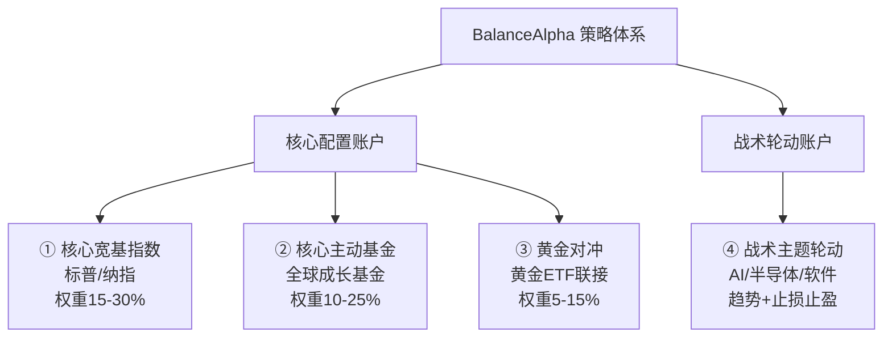

# BalanceAlpha 四大策略模板总结

## 整体架构

系统使用**双账户**架构，将投资策略分为两大类：

| 账户类型 | 策略哲学 | 操作频率 | 风控方式 |
|---|---|---|---|
| **核心配置账户** (Core) | 配置优先，长期持有 | 月度检查 | 权重偏离再平衡 |
| **战术轮动账户** (Tactical) | 趋势优先，主动交易 | 日/周度检查 | 严格止损止盈 |

---

## 策略一：核心宽基指数策略 (`core_index_template`)

> **适用产品**：标普500 (161125)、纳指100ETF (513110)

### 核心参数
| 参数 | 值 | 含义 |
|---|---|---|
| 目标权重区间 | 15% ~ 30% | 单产品在核心账户中的权重范围 |
| 再平衡阈值 | 20% | 权重偏离目标中位超此比例触发再平衡 |
| 评分买入阈值 | ≥70 分 | 允许新增资金 |
| 评分持有阈值 | 55~69 分 | 持有观察 |
| 允许定投 | ✅ | 支持定投模式 |

### 决策逻辑
```
评分 = 回撤分(40) + 配置缺口分(20) + 趋势分(20) + 质量分(20)

≥70 → allow_buy（允许新增资金配置）
55~69 → hold（持有观察）
<55 → suspend_add（暂停新增）

若权重偏离 >20% → rebalance（最高优先级再平衡）
```

### 特点
- **不做频繁止损**，跌了反而可能加分（回撤分更高）
- 优先用新增资金纠偏，而非卖出调仓
- 适合被动跟踪型指数产品

---

## 策略二：核心主动基金策略 (`core_active_fund_template`)

> **适用产品**：嘉实全球产业升级QDII (017731)、易方达全球成长精选DQII (012922)

### 核心参数
| 参数 | 值 | 含义 |
|---|---|---|
| 目标权重区间 | 10% ~ 25% | 比宽基指数略窄（单只主动基金风险更高） |
| 再平衡阈值 | 20% | 偏离比例 |
| 允许定投 | ✅ | 月度定投 |
| 定投频率 | monthly | 按月定投 |

### 决策逻辑
与核心宽基指数策略**共用同一套评分体系**（回撤40 + 缺口20 + 趋势20 + 质量20），但参数不同：
- 目标权重更窄 → 更容易触发再平衡
- 未来可扩展：基金经理变更监控、风格漂移监控

### 特点
- 同属核心账户，长期配置思路
- 单只基金的目标权重比指数更保守（上限25% vs 30%）
- V1阶段质量分暂用默认值，后续可引入基金经理/风格监控

---

## 策略三：黄金对冲策略 (`gold_hedge_template`)

> **适用产品**：天弘上海金ETF联接C (014662)

### 核心参数
| 参数 | 值 | 含义 |
|---|---|---|
| 目标权重区间 | 5% ~ 15% | 仅作为组合"平衡器"，不是主力仓位 |
| 再平衡阈值 | 20% | 偏离比例 |
| 允许主动加仓 | ❌ | 不主动追涨 |
| 允许定投 | ✅ | 被动配置 |

### 决策逻辑
同样使用核心账户评分体系，但关键差异是：
- **权重很窄（5%~15%）** → 黄金超配时更快触发减仓型再平衡
- 不主动加仓 → 黄金涨多了反而提示减配（回归目标权重）
- 核心定位是**对冲器/稳定器**，而非收益来源

### 特点
- 黄金在组合中的角色是降低波动、对冲风险
- 目标权重最低（中位仅10%），防止黄金占比失控
- 实际场景：当前黄金权重32.6%远超目标（偏离222%），系统正确触发了高优先级再平衡

---

## 策略四：战术主题轮动策略 (`tactical_theme_template`)

> **适用产品**：易方达人工智能ETF联接C (012734)、华泰柏瑞中韩半导体ETF联接C (019455)、中欧软件开发指数C (020485)

### 核心参数
| 参数 | 值 | 含义 |
|---|---|---|
| MA短期 | 20日 | 趋势确认基准线 |
| MA长期 | 60日 | 中期趋势方向 |
| 初始仓位 | 30% | 试探性建仓 |
| 确认加仓条件 | 盈利 ≥4% | 盈利确认后加满计划仓 |
| 止损（减半） | -8% | 预警减仓 |
| 止损（清仓） | -10% | 强制清仓 |
| 一级止盈 | +15% | 止盈1/3仓位 |
| 二级止盈 | +25% | 再止盈1/3仓位 |
| 移动止盈 | -8%（从高点） | 剩余仓位跟踪止盈 |

### 决策逻辑（已持仓）
```
盈亏 ≤ -10%  → stop_loss（清仓止损）        优先级1
盈亏 ≤ -8%   → reduce（预警减半仓）          优先级2
盈亏 ≥ +25%  → take_profit（二级止盈1/3）    优先级2
盈亏 ≥ +15%  → take_profit（一级止盈1/3）    优先级3
盈亏 +4%~15% + 价格>MA20 → allow_add（确认加仓） 优先级4
其他          → hold（持有观察）              优先级5
```

### 决策逻辑（未持仓）
```
价格 > MA20 且 MA20 > MA60 → allow_buy（趋势确认，试探买入）
其他                        → observe（观察等待）
```

### 特点
- **完全不同于核心策略**：不看评分、不看权重，只看**趋势 + 盈亏**
- 纪律性极强：止损线硬性执行，不存在"摊低成本"
- 分级止盈设计：不贪不怕，逐步锁定利润
- 趋势确认后才入场（30%试仓），盈利确认后才加仓

---

## 四策略对比一览



| 维度 | ①宽基指数 | ②主动基金 | ③黄金对冲 | ④主题轮动 |
|---|---|---|---|---|
| 账户 | Core | Core | Core | Tactical |
| 决策驱动 | 评分+权重 | 评分+权重 | 评分+权重 | 趋势+盈亏 |
| 目标权重 | 15%~30% | 10%~25% | 5%~15% | 10%~30% |
| 止损机制 | 无 | 无 | 无 | -8%减半/-10%清 |
| 止盈机制 | 无 | 无 | 无 | +15%/+25%分级 |
| 再平衡 | ✅ 偏离>20% | ✅ 偏离>20% | ✅ 偏离>20% | ❌ |
| 定投 | ✅ | ✅ 月度 | ✅ | ❌ |
| 操作频率 | 月度 | 月度 | 月度 | 日/周 |
