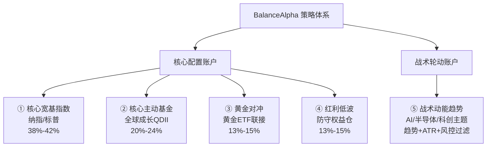

# BalanceAlpha 五大策略模板总结（V2.1）

## 整体架构

系统使用**双账户**架构，将投资策略分为两大类：

| 账户类型 | 策略哲学 | 操作频率 | 风控方式 |
|---|---|---|---|
| **核心配置账户** (Core) | 配置优先，区间仓位管理 | 月度监控 / 年度校准 | 逻辑止损 + 区间再平衡 + 现金缓冲 |
| **战术轮动账户** (Tactical) | 趋势优先，主动交易 | 日/周度检查 | ATR 动态止损 + 趋势止盈 + 洗盘过滤 |

### 核心账户统一约束

| 模块 | 目标区间 | 说明 |
|---|---|---|
| 核心总仓位 | 90% ~ 95% | 留出 5% ~ 10% 现金/货基缓冲 |
| 现金/货基 | 5% ~ 10% | 用于回撤补仓、再平衡和降低踏空风险 |
| 宽基指数合计 | 38% ~ 42% | 核心进攻主轴 |
| 主动基金合计 | 20% ~ 24% | 受控增强，不再过重 |
| 黄金 + 红利低波合计 | 26% ~ 30% | 防守层与组合缓冲层 |

### 统一执行原则
- 核心账户不做价格维度止损，主要通过**区间仓位**与**再平衡**控制风险。
- 核心账户的现金/货基不是空仓，而是**预留弹药**。
- 核心账户默认执行顺序是：`先看总仓位` → `再看各模块是否出区间` → `最后才决定新增资金流向`。
- 核心账户卖出只做三类动作：`超配回归`、`逻辑失效退出`、`组合层面降风险`。
- 战术账户的确认性交易动作尽量放在**14:50 以后**执行，降低盘中假突破干扰。

---

## 策略一：核心宽基指数策略 (`core_index_template`)

> **适用产品**：纳指100ETF (513110)、标普500LOF (161125)

### 核心参数
| 参数 | 值 | 含义 |
|---|---|---|
| 纳指100目标权重区间 | 20% ~ 24% | 核心账户中的进攻主引擎 |
| 标普500目标权重区间 | 16% ~ 20% | 核心 Beta 底仓 |
| 宽基指数合计区间 | 38% ~ 42% | 核心账户权益主轴 |
| 现金缓冲配合 | 5% ~ 10% | 超过 10% 时优先补宽基，低于 5% 时停止主动加仓 |
| 再平衡触发 | 任一产品超出区间，或宽基合计超出区间 | 执行回归中位值 |
| 允许定投 | ✅ | 但只在现金仓与区间条件允许时执行 |
| 评分用途 | 新增资金排序 | 仅决定“先补谁”，不作为卖出条件 |

### 决策逻辑
```text
若核心总仓位 < 90% 且现金/货基 > 10%：
- 优先补宽基指数合计至中位值 40%

若纳指100 < 20%：
- allow_buy_ndx（优先补进攻主轴）

若标普500 < 16%：
- allow_buy_spx（补核心底仓）

若纳指100 > 24%：
- rebalance_down_ndx（减仓回到 22% 附近）

若标普500 > 20%：
- rebalance_down_spx（减仓回到 18% 附近）

若宽基指数合计处于 38%~42%，且两只产品都在各自区间内：
- hold（维持，不做主动调仓）
```

### 风控特点
- **宽基指数是核心账户的主进攻腿**，优先承接新增资金。
- 纳指100负责弹性，标普500负责更广谱的全球大盘 Beta。
- 评分体系保留，但只作为**新增资金分配器**，不再主导卖出。

---

## 策略二：核心主动基金策略 (`core_active_fund_template`)

> **适用产品**：嘉实全球产业升级QDII (017731)、易方达全球成长精选QDII (012922)

### 核心参数
| 参数 | 值 | 含义 |
|---|---|---|
| 单只基金目标权重区间 | 10% ~ 12% | 控制单一主动管理风险 |
| 主动基金合计区间 | 20% ~ 24% | 受控增强仓位 |
| 现金缓冲配合 | 仅在现金/货基 > 5% 时允许新增 | 不挤占现金安全垫 |
| 定投频率 | monthly | 仅对低配基金执行 |
| 逻辑止损 | Alpha 失效 | 不看短期涨跌，看超额收益能力 |
| 资金回流方向 | 宽基指数 / 现金仓 | 退出后不在同类主动基金之间轮动 |

### 决策逻辑
```text
若单只基金 < 10%，且主动基金合计 < 24%，且现金/货基 > 5%：
- allow_add（允许定投或低配补仓）

若单只基金 > 12%：
- rebalance_down_single（减仓回到 11% 附近）

若主动基金合计 > 24%：
- rebalance_down_group（优先降低涨幅更大或逻辑更弱的一只）

若满足以下任一条件：
1. 连续两个季度显著跑输业绩基准
2. 基金经理发生关键变更
3. 投资风格或核心赛道出现明显漂移
- full_exit（清仓，资金回流宽基指数或现金仓）

其他：
- hold（保持观察）
```

### 风控特点
- 主动基金的定位是**增强收益**，不是核心底仓。
- 主动基金的卖出逻辑只看**能力失效**，不做情绪化止损。
- 组合层面上，主动基金权重被控制在可承受范围内，不再成为主导风险源。

---

## 策略三：黄金对冲策略 (`gold_hedge_template`)

> **适用产品**：天弘上海金ETF联接C (014662)

### 核心参数
| 参数 | 值 | 含义 |
|---|---|---|
| 目标权重区间 | 13% ~ 15% | 组合缓冲器与尾部风险对冲仓 |
| 中位参考值 | 14% | 再平衡回归点 |
| 允许主动加仓 | ❌ | 不做情绪化追涨 |
| 允许被动补仓 | ✅ | 仅在低于下限时被动恢复配比 |
| 再平衡触发 | 超出 13%~15% 区间 | 超配优先处理 |
| 资金去向 | 现金仓 / 低配宽基 | 黄金减仓后不在黄金内部回转 |

### 决策逻辑
```text
若黄金权重 > 15%：
- rebalance_down（减仓回到 14% 附近）

若黄金权重 < 13% 且现金/货基 > 10%：
- rebalance_up_passive（被动补仓回到区间下沿）

若黄金与股票类资产同步下跌，且黄金仍高于 15%：
- priority_reduce（优先降低黄金仓位，修复对冲失效）

若黄金位于 13%~15%：
- hold（维持配置，不主动追涨）
```

### 风控特点
- 黄金是**防守层**，不是收益主引擎。
- 黄金超配时，优先级高于新增买入动作。
- 当“对冲失效 + 权重超标”同时出现时，必须优先降权。

---

## 策略四：红利低波策略 (`dividend_low_vol_template`)

> **适用产品**：南方标普中国A股大盘红利低波50联接C (008164)

### 核心参数
| 参数 | 值 | 含义 |
|---|---|---|
| 目标权重区间 | 13% ~ 15% | 防守型权益仓，不是债券替代 |
| 中位参考值 | 14% | 再平衡回归点 |
| 组合角色 | 防守权益 + 现金流因子 | 降波动、稳定权益侧体验 |
| 允许定投 | ✅ | 但优先级低于宽基指数 |
| 再平衡触发 | 超出 13%~15% 区间 | 低配可补，高配回收 |
| 特殊监控 | 跟踪误差 / 指数规则大改 | 触发策略复核 |

### 决策逻辑
```text
若红利低波 < 13%，且现金/货基 > 5%：
- allow_add（允许补仓至区间下沿）

若红利低波 > 15%：
- rebalance_down（减仓回到 14% 附近）

若红利低波与黄金合计 > 30%：
- priority_trim_defense（优先压缩超配部分，释放给宽基或现金）

若出现以下任一情况：
1. 产品长期显著偏离跟踪指数
2. 指数编制规则发生重大变化
- review_required（进入策略复核，不自动加仓）

其他：
- hold（维持防守型权益配置）
```

### 风控特点
- 红利低波是**防守型股票仓**，不是债券替代品。
- 它的任务是降低组合波动，不是承担进攻职责。
- 当核心账户更进攻时，红利低波仍要保留，但权重应受区间限制。

---

## 策略五：战术动能趋势策略 (`tactical_theme_template`, V2.0)

> **适用产品**：高弹性、强主题型 ETF，如 AI、半导体、计算机、科创50 等

### 核心指标
| 指标 | 参数 | 用途 |
|---|---|---|
| MA20 | 20日简单移动平均线 | 核心趋势线，多空分界 |
| MA60 | 60日简单移动平均线 | 中期趋势过滤 |
| Volume | 5日均量线 (MA5) | 判断突破是否有资金确认 |
| RSI | 14周期 | 判断强势区与过热区 |
| ATR | 20周期 | 动态止损、加仓与仓位测算核心参数 |

### 核心参数
| 参数 | 值 | 含义 |
|---|---|---|
| 初始仓位 | 40% | 放量突破后的底仓 |
| 单次右侧加仓 | 30% | 结构确认后的进攻仓 |
| 入场确认时点 | 14:50 以后 | 避免盘中假突破 |
| 加仓前提 | 浮盈 > 1 × ATR20 | 用利润做安全垫 |
| 盈利保护 | 浮盈 > 9% | 止损线上移至成本价 |
| 极值止盈 | RSI > 80 | 当日减仓 50% |

### 决策逻辑（未持仓）
```text
价格由下向上放量突破 MA20
且 当日成交量 > 5日平均成交量
且（优先过滤）MA20 > MA60
→ allow_buy（14:50 后建立 40% 底仓）

其他 → observe（继续等待）
```

### 决策逻辑（已持仓）
```text
买入价下浮 1 × ATR20                    → hard_stop（初始硬止损）
收盘价有效跌破 MA20 且次日未收回         → trend_exit（趋势止盈/清仓）
RSI(14) > 80                            → take_profit（减仓 50%）
浮盈 > 9%                               → move_stop_to_cost（止损上移至成本价）

若同时满足以下条件：
1. 浮盈 > 1 × ATR20
2. 价格稳在 MA20 之上
3. RSI(14) 位于 50~75
4. 出现“回踩 MA10/MA20 反包”或“放量突破前高”
→ add_position（加仓 30%）
```

### 风控升级：洗盘 vs 反转过滤器
当持仓接近传统 `-8%` 预警区，但尚未完全破坏趋势时，启动二次判断：

```text
若评分 ≥ 4（偏洗盘）：
- 允许临时放宽止损至 -12%
- 设置 48 小时观察期，等待缩量回升确认

若评分 ≤ -3（偏反转）：
- 无需等待 -10%
- 可在 -5%~-6% 先行抢跑止损
```

### 仓位测算公式
```text
N = (C × R) / ATR20
```

其中：
- `N`：应买入的份额数量
- `C`：战术账户总可用资金
- `R`：单笔交易最大可承受回撤比例（建议 1%~2%）

### 风控特点
- **只做右侧交易**，不用逆势抄底。
- **不再使用固定 4% 盈利加仓**，改为 ATR 自适应波动率门槛。
- 用 **MA20 + RSI + 量能 + ATR** 组成完整的趋势执行闭环。
- 盈利后优先保护利润，再考虑进攻性加仓。

---

## 统一风控框架

### 核心账户：区间再平衡
- 先看**核心总仓位是否在 90%~95%**，不满足时先修正现金仓。
- 再看三大模块是否出区间：`宽基 38%~42%`、`主动 20%~24%`、`黄金+红利 26%~30%`。
- 最后再看单品是否出区间，并回归各自中位值。
- 默认使用**新增资金修正低配**，只有超配或逻辑失效时才卖出。

### 战术账户：动态弹性止损
- 第一层：`1 × ATR20` 初始硬止损。
- 第二层：`MA20` 跌破后的趋势退出。
- 第三层：`-8%/-10%` 预警区间内启动“洗盘 vs 反转”过滤器。
- 第四层：盈利超过 `9%` 后，止损上移至成本价。

### 资金回流规则
- 核心账户再平衡释放的资金优先补低配宽基，其次补低配防守仓，最后进入现金/货基。
- 主动基金逻辑退出后的资金，默认不在主动基金内部轮动，优先回流宽基或现金。
- 战术账户止损释放的资金先回到**现金/货币基金**，不做同板块情绪化抄底。

---

## 五策略对比一览



| 维度 | ①宽基指数 | ②主动基金 | ③黄金对冲 | ④红利低波 | ⑤战术动能趋势 |
|---|---|---|---|---|---|
| 账户 | Core | Core | Core | Core | Tactical |
| 决策驱动 | 区间 + 新增资金排序 | 区间 + Alpha | 权重 + 对冲有效性 | 权重 + 防守属性 | 趋势 + ATR + RSI + 量能 |
| 仓位框架 | 38%~42% 合计 | 20%~24% 合计 | 13%~15% | 13%~15% | 40%底仓 + 30%右侧加仓 |
| 止损机制 | 无价格止损 | Alpha 失效清仓 | 超配减仓 | 超配减仓 / 规则复核 | ATR硬止损 + 趋势退出 |
| 止盈机制 | 无 | 无 | 无 | 无 | RSI>80减仓 + MA20跟踪 |
| 再平衡 | ✅ 出区间即处理 | ✅ 出区间即处理 | ✅ 出区间即处理 | ✅ 出区间即处理 | ❌ |
| 定投 | ✅ 条件式 | ✅ 条件式 | ✅ 被动式 | ✅ 低优先级 | ❌ |
| 操作频率 | 月度 | 月度 | 月度 | 月度 | 日/周 |

